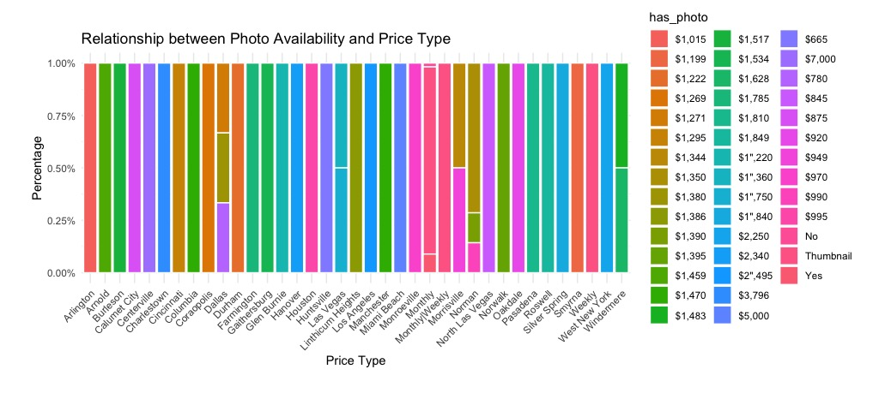
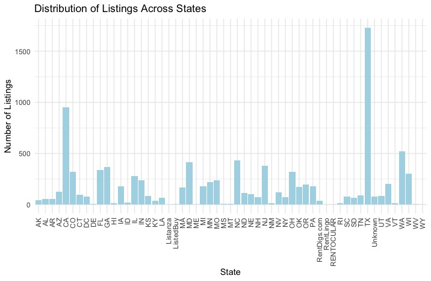
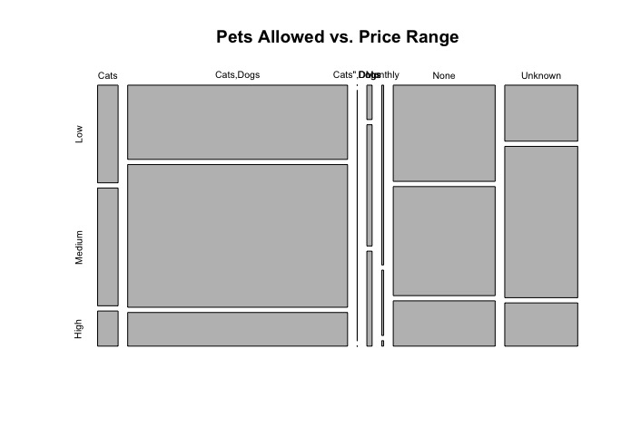
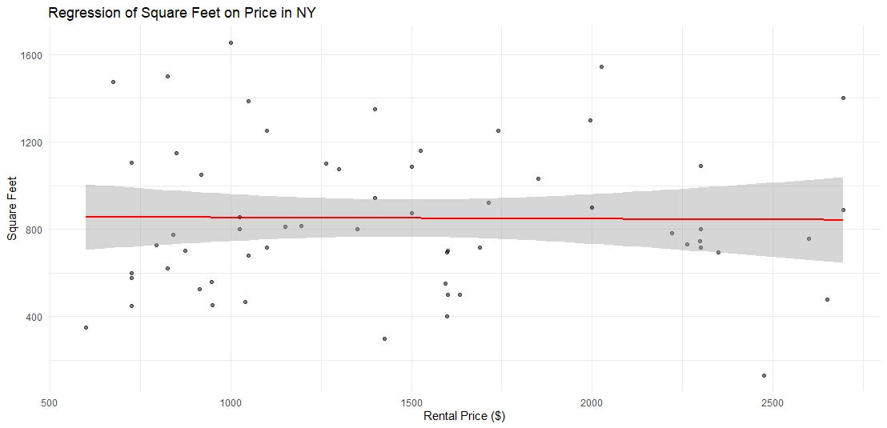
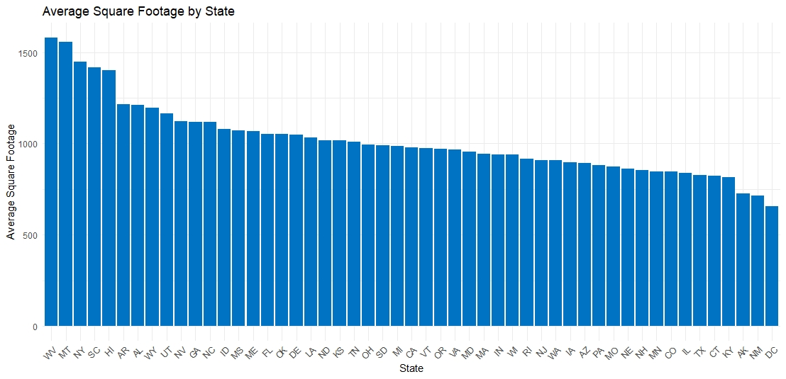

<!--- Rmarkdown for the paper. --->
<!--- Zachary Perry group 5 I think --->

---
title: "Summary of Research and EDA Process on the Apartment Rental Dataset"
author: "Zachary Perry"
date: "`r Sys.Date()`"
output: html_document
---

```{r setup, include=FALSE}
knitr::opts_chunk$set(echo = FALSE)
```

## Introduction

The U.S. rental market plays a crucial role in the economy, being influenced by a range of socio-economic factors. With more data now available, we have a chance to gain deeper insights into this market.

In this report, we examine a dataset of 10,000 U.S. apartment rentals from the UCI database, enhanced with "RentLingo" listings. We focus on key attributes like location, square footage, and amenities, giving us a broad view of the rental scene.

## 1. What do we know about this dataset?

The dataset provides a comprehensive view of the U.S. apartment rental landscape, capturing key attributes of rental listings. Among the most informative variables, we have location data, which includes attributes like state and city, pinpointing the geographical context of each listing. Additionally, there are physical characteristics that reveal details such as square footage, indicating the size and layout of the apartment. We also have amenities, a qualitative descriptor that highlights the additional features or services that come with each rental.

### 1.1 Data Source and Observations

The dataset, sourced from the UCI database, consists of 10,000 observations. Each entry represents a unique rental listing, forming a solid foundation for our analysis. As with many externally acquired datasets, cleaning the data was an essential step to ensure its quality and reliability. What follows is an overview of the dataset, showcasing variable definitions and pinpointing any missing values, which offers clarity regarding our analytical scope.

<!-- % The code to generate this needs to be inset -->


### 1.2 Attributes and Data Dimensions

The dataset captures several key attributes of rental listings. The state indicates the geographical location of the listing, which aids in regional trend analysis. The size of the property is denoted by square_feet, a primary influencer of the rental price. Rental prices are reflected in the price_display. Information about the apartment's structure is provided through bedrooms and bathrooms. Additionally, the amenities column lists the extra features or facilities associated with the property. These variables, among others, allow for a thorough exploration of the US rental market landscape.

To understand the relationships between these attributes, especially the numerical ones, a correlation matrix can be invaluable:

<!-- % Need the inset code to create the correllation matrix -->


This matrix provides a visual representation of how different variables in the dataset relate to each other. Strong correlations, whether positive or negative, can hint at underlying patterns and relationships that might be pivotal in subsequent analyses.

## 3. How was the information gathered?

The origin of this dataset is the UCI database, but the original data compilation was executed by "RentLingo", an online platform. This suggests a digital scraping or aggregation method, wherein listings from various sources might have been collated. It's essential to recognize the potential biases that might arise from such collection methods, such as over-representation of certain types of listings or geographies.

## 4. Inital Analyses and Findings

Diving into the dataset, we first focused on data refinement, ensuring its clarity and usability. This step was crucial in setting up a comprehensive Exploratory Data Analysis (EDA). During EDA, we identified key patterns and relationships between various attributes. Our main objective was to grasp the dataset's depth and its potential for predictive modeling.

An important aspect of our analysis was to assess the significance of using the states column to group listings, as the real estate market is extremely localized. To validate this approach, we used an ANOVA test, the results of which are shared in the subsequent section.

<!-- % Need the inset code for this section -->


A strikingly low p-value of \(2 \times 10^{-16}\)  robustly attests to the significance of grouping listings by state. This result indicates that not only is state-based categorization valid, but it's also a potent tool for drawing accurate conclusions and shaping predictive models. This insight reinforces the value of considering regional variations within the dataset.

## 5. Research Contribution to Question Development

In our initial analysis phase, we identified two distinct categories within the data: invariant and variant factors. We first turned our attention to the invariant factors, such as the impact of photo availability on rental prices. These factors provided insights that were consistent regardless of location.

As our analysis progressed, the variant factors, particularly those related to geographic location, came into sharper focus. We observed noticeable differences in rental prices across states, leading us to craft state-specific questions. For example, we explored whether an apartment's proximity to city centers or its size influenced its rental price differently in various states.

This structured approach allowed us to dissect the data methodically, beginning with universal trends and then zooming in on location-based nuances.

### Chi-Squared Results

Test 1: Relationship between Photo Availability and Price Type

We examine how the availability of photos in a listing correlates with the way rental prices are presented.
In this stacked bar chart, we can see that there are noticeable differences in photo availability across various price types.


``` {r , echo = FALSE, message=FALSE, warning=FALSE}

################################################################################
# Chi-Square Test on the Relationship Between Photo Availability and Price Type
################################################################################

# Load necessary libraries
if (!require(readxl)) {
  install.packages("readxl")
}
library(readxl)

if (!require(tidyverse)) {
  install.packages("tidyverse")
}
library(tidyverse)

# Read the dataset
data <- read_excel("cleaned_data.xlsx")

# Creating a contingency table for photo availability and price type
contingency_table_photo_price <- table(data$has_photo, data$price_type)

# Performing the Chi-Square Test of Independence
chi_square_test_photo_price <- chisq.test(contingency_table_photo_price)

# Printing the results of the Chi-Square test
print(chi_square_test_photo_price)

# Using ggplot to create a stacked bar plot to show the relationship between photo availability and price type

if (!require(scales)) {
  install.packages("scales")
}
library(scales)

if (!require(ggplot2)) {
  install.packages("ggplot2")
}
library(ggplot2)

ggplot(data, aes(x = price_type, fill = has_photo)) +
  geom_bar(position = "fill", color = "white") +  
  scale_y_continuous(labels = percent_format(scale = 1)) +  
  labs(title = "Relationship between Photo Availability and Price Type",
       x = "Price Type",
       y = "Percentage") +  
  theme_minimal() +  # Using a minimal theme for a cleaner look
  theme(axis.text.x = element_text(angle = 45, hjust = 1),  
        plot.margin = unit(c(1, 1, 1, 1), "cm"))  

```

<!--   -->

Test 2: Distribution of Listings Across States

We also take a look at the geographical distribution of apartment listings across the United States. 
In this visualization, each bar represents a state, and the height of the bar correlates with the number of listings in that state.
There are clear trends visible, with certain states showing a much higher number of listings, such as California and Texas.This uneven distribution indicates potential market hotspots and areas that may require more attention or resources to boost listing numbers.

``` {r , echo = FALSE, message=FALSE, warning=FALSE}

################################################################
# Chi-Square Test on the Distribution of Listings Across States
################################################################

# Install necessary packages
if (!require(readxl)) {
  install.packages("readxl")
}
library(readxl)

if (!require(tidyverse)) {
  install.packages("tidyverse")
}
library(tidyverse)

# Read the dataset
data <- read_excel("cleaned_data.xlsx")

# Data cleaning
# Check the number of unique states
num_states <- length(unique(data$state))

# Create a vector of expected frequencies
expected_frequencies <- rep(1/num_states, num_states)

# Creating a contingency table of the number of listings in each state
contingency_table <- table(data$state)

# Performing the Chi-Square test
chi_square_test_state <- chisq.test(contingency_table)

# Printing the results of the Chi-Square test
print(chi_square_test_state)

# Visualize the distribution of listings across states using a bar plot
ggplot(data, aes(x = state)) +
  geom_bar(fill = "#ADD8E6") +
  labs(title = "Distribution of Listings Across States",
       x = "State",
       y = "Number of Listings") +
  theme_minimal() +
  theme(axis.text.x = element_text(angle = 90, vjust = 0.5, hjust = 1))

```

<!--   --->

Test 3: Association Between Pets Allowed Status and Rent Prices

We also Investigate the association between "pets allowed" status and different rent price ranges, by using Chi-square test on the contingency table of "pets allowed" status and rent price categories.
We categorized the rental prices into three ranges: Low, Medium, and High.
A Chi-square test was conducted on a contingency table, comprising these price ranges and the pets allowed status. 
The results were quite telling, with a Chi-square value of 292.76, and an extremely low p-value, practically zero. 
This leads us to reject the null hypothesis, concluding a significant association between the pets allowed status and the rental price ranges. 

``` {r , echo = FALSE, message=FALSE, warning=FALSE}

##################################################################################
# Chi-Square Test on the Relationship Between Pets Allowed Status and Price Range
##################################################################################

# Creating a new variable for price range based on the 'price' variable
data$price_category <- cut(data$price,
                           breaks = c(-Inf, 1000, 2000, Inf),
                           labels = c("Low", "Medium", "High"))

# Creating a contingency table of pets allowed status against price range
contingency_table_pets_price <- table(data$pets_allowed, data$price_category)

# Perform Chi-Square Test
chi_square_test_pets_price <- chisq.test(contingency_table_pets_price)

# Printing the results of the Chi-Square test
print(chi_square_test_pets_price)

mosaicplot(contingency_table_pets_price, main = "Pets Allowed vs. Price Range",
           cex.axis = 0.7, 
           las = 2,   
           mar = c(5, 4, 2, 2) + 0.1)  

```

<!--  --->
<!-- #### Test of SubSet -->

#### Photo Impact on Rental Prices

Do apartments with photos tend to have higher rental prices compared to those without photos, and what other attributes might be contributing to this price difference?

We investigated whether apartments with photos command higher rental prices compared to those without. Utilizing a T-Test, we found a t-value of -0.59059 and a p-value of 0.5553, indicating no significant price difference based on the presence of photos. The confidence interval, extending from -126.19 to 67.97, further confirms this finding.

``` {r , echo = FALSE, message=FALSE, warning=FALSE}

# Loading the necessary libraries
library(readr)
library(ggplot2)
library(dplyr)

# Reading the CSV file
data <- read_excel("cleaned_data.xlsx")

# Data Cleaning and Transformation
data$has_photo <- as.numeric(data$has_photo == "Yes")
data$bathrooms <- ifelse(is.na(data$bathrooms), median(data$bathrooms, na.rm = TRUE), data$bathrooms)
data$bedrooms <- ifelse(is.na(data$bedrooms), median(data$bedrooms, na.rm = TRUE), data$bedrooms)
data$square_feet <- as.numeric(data$square_feet)
data$square_feet[is.na(data$square_feet)] <- median(data$square_feet, na.rm = TRUE)

# Data Analysis
# Calculate average prices
avg_price_with_photo <- mean(data$price[data$has_photo == 1])
avg_price_without_photo <- mean(data$price[data$has_photo == 0])

# Perform a t-test
t_test_result <- t.test(price ~ has_photo, data = data)
#print(t_test_result)

# Multivariate Linear Regression
model <- lm(price ~ has_photo + bathrooms + bedrooms + square_feet, data = data)
#summary(model)

# Visualization
p1 <- ggplot(data, aes(x = as.factor(has_photo), y = price)) +
  geom_boxplot() +
  labs(title = "Rental Price Comparison: Apartments with Photos vs Without Photos",
       x = "Has Photo",
       y = "Rental Price ($)") +
  theme_minimal()

p2 <- ggplot(data, aes(x = bathrooms, y = price, color = as.factor(has_photo))) +
  geom_point(alpha = 0.5) +
  labs(title = "Price vs Bathrooms",
       x = "Number of Bathrooms",
       y = "Rental Price ($)") +
  theme_minimal()

print(p1)
print(p2)


```

#### Detecting Outliers

Can we detect any unusual patterns or anomalies in the dataset, such as exceptionally low or high rental prices, and what contextual information can explain these anomalies?
In this analysis, we aim to uncover unusual patterns in the dataset, focusing particularly on anomalies in rental prices. While the average rental price stands at around 1,483, there are listings with prices soaring to 52,500. Through visualizations like box plots and scatter plots, along with summary statistics, we delve into these extremes to understand their nature and context.

``` {r , echo = FALSE, message=FALSE, warning=FALSE}

# Load necessary libraries
library(readr)
library(ggplot2)
library(dplyr)
library(readxl)

# Read the data
data <- read_excel("cleaned_data.xlsx")

# Data Cleaning and Transformation
data <- data %>%
  mutate(
    has_photo = if_else(has_photo == "Yes", 1, 0),
    bathrooms = as.numeric(bathrooms),
    bedrooms = as.numeric(bedrooms),
    square_feet = as.numeric(square_feet)
  ) %>%
  mutate(
    bathrooms = ifelse(is.na(bathrooms), median(bathrooms, na.rm = TRUE), bathrooms),
    bedrooms = ifelse(is.na(bedrooms), median(bedrooms, na.rm = TRUE), bedrooms),
    square_feet = ifelse(is.na(square_feet), median(square_feet, na.rm = TRUE), square_feet)
  )

# Visualizing the Distribution of Rental Prices
p1 <- ggplot(data, aes(x = price)) +
  geom_histogram(binwidth = 100) +
  theme_minimal() +
  labs(title = "Distribution of Rental Prices", x = "Rental Price ($)", y = "Frequency",
       caption = "The histogram shows the distribution of rental prices. Notice any skewness or potential outliers.")
print(p1)
#ggsave("Distribution_of_Rental_Prices.jpg", plot = p1, width = 10, height = 8, units = "cm")

# Summary Statistics of Rental Prices
summary_stats <- summary(data$price)
print(summary_stats)

# Identifying and Visualizing Anomalies in Rental Prices
Q1 <- quantile(data$price, 0.25)
Q3 <- quantile(data$price, 0.75)
IQR <- Q3 - Q1
lower_bound <- Q1 - 1.5 * IQR
upper_bound <- Q3 + 1.5 * IQR

outliers <- data %>% filter(price < lower_bound | price > upper_bound)

# Using Box Plot to visualize anomalies in rental prices
p_boxplot <- ggplot(data, aes(y = price)) + 
  geom_boxplot(outlier.colour = "red", outlier.shape = 8, outlier.size = 4) + 
  labs(title = "Detecting Price Outliers", y = "Rental Price ($)",
       caption = "The box plot visualizes the spread of rental prices. The middle 50% of the prices are within the box, while the lines (whiskers) extend to the smallest and largest values within 1.5 times the interquartile range. Prices beyond these whiskers are considered outliers and are highlighted in red.") +
  theme_minimal()
print(p_boxplot)
#ggsave("Detecting_Price_Outliers.jpg", plot = p_boxplot, width = 10, height = 8, units = "cm")

# High Price Outliers

# Analyze high price outliers to understand the characteristics of listings that are priced high.
high_price_outliers <- subset(data, price > upper_bound)
p_high <- ggplot(high_price_outliers, aes(x = bedrooms, y = price)) +
  geom_point(aes(color = "High Price Outliers"), size = 3) +
  theme_minimal() +
  labs(title = "High Rental Prices", x = "Number of Bedrooms", y = "Rental Price",
       caption = "This plot shows listings with unusually high rental prices. Each point represents a listing.")
print(p_high)
#ggsave("Low_Rental_Prices.jpg", plot = p_low, width = 10, height = 8, units = "cm")


```


SMART Question 9: What is the average rental price per square foot for apartments in different states within the dataset, and how do these prices compare to the overall dataset average?

In addressing Question 9, we determined the average rental price per square foot for apartments in various states. This measure offers insights into the typical costs renters might face based on apartment size across different regions. When juxtaposing these state-specific averages against the overall dataset average, we observed distinctive regional pricing trends. The ensuing chart details these discrepancies, displaying how each state's average price per square foot relates to the national average:

<!-- Zac needs to inset the code here. -->
<!--  -->

``` {r , echo = FALSE, message=FALSE, warning=FALSE,out.width='100%', fig.align='center'}

###############################################################################
### SMART Question 9
###############################################################################

# here we have two checks to make sure that the packages are loaded and installed
if (!require(readxl)) {
  install.packages("readxl")
}
library(readxl)

if (!require(knitr)) {
  install.packages("knitr")
}
library(knitr)

if (!require(dplyr)) {
  install.packages("dplyr")
}
library(dplyr)

# Read the Excel file
df <- read_excel("cleaned_data.xlsx")

# List of valid US state abbreviations
valid_states <- c(
    "AL", "AK", "AZ", "AR", "CA", "CO", "CT", "DE", "FL", "GA",
    "HI", "ID", "IL", "IN", "IA", "KS", "KY", "LA", "ME", "MD",
    "MA", "MI", "MN", "MS", "MO", "MT", "NE", "NV", "NH", "NJ",
    "NM", "NY", "NC", "ND", "OH", "OK", "OR", "PA", "RI", "SC",
    "SD", "TN", "TX", "UT", "VT", "VA", "WA", "WV", "WI", "WY"
)

# Update the list of valid US state abbreviations to include DC
valid_states <- c(valid_states, "DC")

# Filter out rows where the state is not in the list of valid states
filtered_df_with_dc <- df[df$state %in% valid_states, ]

# Convert square_feet to numeric, setting any non-numeric values to NA
filtered_df_with_dc$square_feet <- as.numeric(as.character(filtered_df_with_dc$square_feet))

# Check for any non-numeric values that might have been converted to NAs
na_square_feet_count <- sum(is.na(filtered_df_with_dc$square_feet))
#cat("Number of NA values in square_feet:", na_square_feet_count, "\n")

# Compute the average rental price per square foot and the count of observations for each state
statewise_stats <- filtered_df_with_dc %>%
  filter(!is.na(square_feet) & square_feet > 0) %>%
  group_by(state) %>%
  summarize(
    avg_price_per_sqft = round(mean(price / square_feet, na.rm = TRUE), 2),
    count = n()
  )

# Compute the weighted average rental price per square foot for each state
statewise_stats$weighted_avg_price_per_sqft <- statewise_stats$avg_price_per_sqft * statewise_stats$count

# Compute the overall weighted average rental price per square foot for the entire dataset
overall_weighted_avg_price_per_sqft <- sum(statewise_stats$weighted_avg_price_per_sqft) / sum(statewise_stats$count)

# install the package if necessary, and load it in
if (!require(ggplot2)) {
  install.packages("ggplot2")
}
library(ggplot2)

# Create a bubble plot with adjusted red line label and legend position
bubble_plot <- ggplot(statewise_stats, aes(x = state, y = avg_price_per_sqft, size = count)) +
  geom_point(alpha = 0.7, color = "dodgerblue") +
  geom_hline(yintercept = overall_weighted_avg_price_per_sqft, color = "red", linetype="dashed", size=0.7) +
  annotate("text", x = max(statewise_stats$state), y = overall_weighted_avg_price_per_sqft + 0.1, 
           label = paste0("$", round(overall_weighted_avg_price_per_sqft, 2)), color = "red", hjust = "right") +
  labs(
    title = "Weighted Average Rental Price Per Square Foot by State",
    subtitle = paste0("Overall avg. price/sqft: $", round(overall_weighted_avg_price_per_sqft, 2)),
    x = "State",
    y = "Price ($/sqft)",
    size = "Number of Listings"
  ) +
  theme_minimal() +
  theme(
    axis.text.x = element_text(angle = 45, hjust = 1),  # Rotate x-axis labels by 45 degrees
    legend.position = "top"  # Move the legend to the top
  )

# Display the plot
bubble_plot

```

Interestingly the vast majority of states are below this average, and this is because of the massive skew caused by the California housing market. It is simply egregious and this skew can be visually shown in a graph. Other markets such as MA and HI have similarly priced markets but the size itself is the concern here, as it is the third highest quantity of all 50 states.

<!-- This needs to be inset -->


Deeper into this a regression of sq_ft ~ price for TX, CA, and NY can be taken to show the `Locational Premium` or the amount of price determined by the location as opposed to the square footage. 

<!--

<div style="display: flex; justify-content: space-between;">
  
  
</div>

-->

``` {r , echo = FALSE, message=FALSE, warning=FALSE, fig.align='center', fig.width=10, fig.height=4}

###############################################################################
### SMART Question 10
###############################################################################

# Load necessary packages
if (!require(dplyr)) {
  install.packages("dplyr")
}
library(dplyr)

if (!require(purrr)) {
  install.packages("purrr")
}
library(purrr)

if (!require(tidyr)) {
  install.packages("tidyr")
}
library(tidyr)

if (!require(ggplot2)) {
  install.packages("ggplot2")
}
library(ggplot2)

# Remove outliers
remove_outliers <- function(data, column_name) {
  Q1 <- quantile(data[[column_name]], 0.25, na.rm = TRUE)
  Q3 <- quantile(data[[column_name]], 0.75, na.rm = TRUE)
  IQR <- Q3 - Q1
  
  filter_condition <- (data[[column_name]] >= (Q1 - 1.5 * IQR)) & (data[[column_name]] <= (Q3 + 1.5 * IQR))
  return(data[filter_condition,])
}

filtered_df_no_outliers <- remove_outliers(filtered_df_with_dc, "price")
filtered_df_no_outliers <- remove_outliers(filtered_df_no_outliers, "square_feet")

# Group the data by state and apply the linear regression model to each group, with square_feet as the predictor and price as the response
regression_results <- filtered_df_no_outliers %>%
  group_by(state) %>%
  nest() %>%
  mutate(
    model = map(data, ~ lm(price ~ square_feet, data = .)),
    intercept = map_dbl(model, ~ coef(.)[1]),
    slope = map_dbl(model, ~ coef(.)[2]),
    r_squared = map_dbl(model, ~ summary(.)$r.squared)
  ) %>%
  select(state, intercept, slope, r_squared)

# Display the regression results by state
#print(regression_results)

plot_width <- 5
plot_height <- 3

# As an example, visualize the regression line for the states CA, NY, and TX
selected_states <- c("CA", "NY", "TX")
plots <- list()

for (state in selected_states) {
  state_data <- filter(filtered_df_no_outliers, state == !!state)
  
  plot <- ggplot(state_data, aes(x = square_feet, y = price)) +
    geom_point(alpha = 0.5) +
    geom_smooth(method = "lm", color = "red") +
    labs(
      title = paste0("Regression of Price on Square Feet in ", state),
      x = "Square Feet",
      y = "Rental Price ($)"
    ) +
    theme_minimal()
  
  plots[[state]] <- plot
}

# Display the plots for the selected states
#lapply(plots, print)


# Filter for the states CA, NY, and TX and select the slope column
#selected_slopes <- regression_results %>%
#  filter(state %in% selected_states) %>%
#  select(slope)

# install the package if necessary, and load it in
if (!require(gridExtra)) {
  install.packages("gridExtra")
}
library(gridExtra)


# Assuming plots for CA and TX are stored in plots[["CA"]] and plots[["TX"]] respectively
grid.arrange(plots[["CA"]], plots[["TX"]], ncol=2)

```

Comparing the slopes of CA and TX their slopes are somewhat similar, but the skew of the data itself is immensely different.It is clearly shows the skew of the CA market contrasted against a more affordable market such as with Texas every value has been thrown to the right of the graph. The clustering in Texas much more closely follows the weighted square average calculated earlier.

Finally, we have New York, which seems to have the locational premium makeup the majority of the price of listings. It possesses a negative slope, with ordered pairs of square_foot and price being distributed over the entirety of the graph. This suggests that the housing market of New York is not overly reliant on square footage to determine price but instead on the location of the dwelling itself.

<!--  -->

``` {r , echo = FALSE, message=FALSE, warning=FALSE, fig.align='center', fig.width=10, fig.height=4}
print(plots[["NY"]])
```

To further substantiate our findings, we referred to the graph depicting the average square footage by state (see attached JPEG). The visual representation corroborates our analysis, showing New York leading the pack with the highest average square footage, followed closely by California and then Texas. This pattern aligns with our earlier observation that in areas where rent is less influenced by square footage, the average square footage tends to be higher. Specifically, in New York, where the locational premium seems to dominate rental pricing, dwellings offer more spacious interiors on average compared to other states.

<!--  -->

``` {r , echo = FALSE, message=FALSE, warning=FALSE, fig.align='center', fig.width=10, fig.height=4}

# Load necessary packages
if (!require(readxl)) {
  install.packages("readxl")
}
library(readxl)

if (!require(dplyr)) {
  install.packages("dplyr")
}
library(dplyr)

if (!require(ggplot2)) {
  install.packages("ggplot2")
}
library(ggplot2)

# Load the data
data <- read_excel("cleaned_data.xlsx")

# Filter out non-states
valid_states <- c(
    "AL", "AK", "AZ", "AR", "CA", "CO", "CT", "DE", "FL", "GA",
    "HI", "ID", "IL", "IN", "IA", "KS", "KY", "LA", "ME", "MD",
    "MA", "MI", "MN", "MS", "MO", "MT", "NE", "NV", "NH", "NJ",
    "NM", "NY", "NC", "ND", "OH", "OK", "OR", "PA", "RI", "SC",
    "SD", "TN", "TX", "UT", "VT", "VA", "WA", "WV", "WI", "WY", "DC"
)
data <- data[data$state %in% valid_states,]

# Convert square_feet to numeric
data$square_feet <- as.numeric(data$square_feet)

# Drop rows with NA in square_feet
data <- data[!is.na(data$square_feet),]

# Calculate the average square foot by state
avg_sqft_by_state <- data %>%
  group_by(state) %>%
  summarize(avg_sqft = mean(square_feet, na.rm = TRUE)) %>%
  arrange(-avg_sqft)  # Sort in descending order

# Plot the result with the states on the x-axis and sorted bars
ggplot(avg_sqft_by_state, aes(x = reorder(state, avg_sqft), y = avg_sqft)) +
  geom_bar(stat = "identity") +
  theme(axis.text.x = element_text(angle = 90, vjust = 0.5, hjust=1)) +  # Rotate x-axis labels for better visibility
  labs(title = "Average Square Foot by State", x = "State", y = "Average Square Foot")

```

## 6. Beneficial Augmentations to the Dataset

While the current dataset provides a valuable snapshot of the US apartment rental market, several enhancements can bolster its analytical and predictive capabilities. Incorporating these additions would enable a more robust and nuanced understanding of rental dynamics, catering to various stakeholders in the rental ecosystem.

### 6.1 Year-Round Data

The present dataset captures listings from September to December, offering a limited temporal perspective. A comprehensive year-round dataset would provide insights into how rental trends fluctuate across different seasons. Such information is invaluable for understanding seasonal demand patterns, rental pricing variations, and tenant mobility trends. For example, are there specific months where rentals spike due to student movements or major cultural events? Do certain seasons see a dip in rentals due to climatic challenges? Addressing these questions requires a dataset that spans the entire calendar year.

### 6.2 Enhanced State-Level Observations

One of the challenges faced in our analysis was the limited number of observations for several states, which hindered robust state-level analyses. Ensuring that each state has a statistically significant number of observations would provide a more balanced and accurate representation of regional rental trends. This would enable state-specific insights, allowing for tailored strategies and interventions for different regions.

### 6.3 Non-Bundled Amenities Data

The current dataset provides information on amenities, but there's an opportunity to delve deeper. Listings often bundle multiple amenities together, making it challenging to discern the individual value and appeal of each amenity. A dataset that itemizes non-bundled amenities—listing them separately for each property—would allow for a more granular analysis. For instance, how much value does a gym add compared to a swimming pool? Is a pet-friendly policy more attractive in urban settings compared to suburban ones? By isolating amenities, we can derive more precise insights into their individual impact on rental prices and tenant preferences.

In essence, while the existing dataset serves as a solid foundation for understanding the rental market, these proposed augmentations would significantly enhance its depth and breadth. Such enhancements would ensure that the dataset not only reflects the current rental landscape but also anticipates future trends and challenges.


## 7. Evolution of the Research Question Post-EDA

Exploratory Data Analysis (EDA) is a dynamic process that allows researchers to dive deep into datasets, uncovering patterns, relationships, and insights that might not be immediately evident. This iterative exploration often results in the evolution and refinement of the research questions. Here's how our research questions evolved post-EDA:

### 7.1 Deepened Understanding of Variable Interactions

Our initial questions were primarily centered around the direct relationships between individual variables. However, post-EDA, it became evident that many of these variables interact in complex ways. For instance, the relationship between rental price and amenities isn't linear but may vary based on location, apartment size, or even the season. This nuanced understanding prompted us to reframe our questions to account for these multifaceted interactions.

### 7.2 Emphasis on Geographic Trends

The EDA revealed significant geographic disparities in the dataset, especially concerning rental prices and apartment sizes across different states. This led to a heightened focus on state-specific analyses, with questions tailored to understand the unique rental landscapes of individual states. Queries that initially looked at the US rental market holistically were now complemented by state-centric questions to capture regional nuances.

### 7.3 Incorporation of Qualitative Insights

While our initial questions were predominantly quantitative, the EDA emphasized the importance of qualitative descriptors in the dataset, such as the body and amenities columns. This led to the formulation of questions that sought to understand the perceived value of listings, the narrative appeal, and how qualitative factors influence rental decisions.

### 7.4 Broader Temporal Perspective

The dataset's limitation to the months of September to December initially restricted our temporal analyses. However, post-EDA, we recognized the potential insights that could be gleaned from a year-round perspective, leading to questions about seasonal trends, monthly fluctuations, and the potential impact of major events on rental patterns.

### 7.5 Focus on Potential Biases and Data Limitations

The EDA process highlighted potential biases in the dataset, especially concerning the collection method and the over-representation or under-representation of certain types of listings. This prompted questions about the validity of certain insights, the potential for skewed results, and the need for data augmentation to address these biases.

In conclusion, the EDA process was instrumental in refining our research direction. It allowed us to pivot from broader, more general questions to specific, nuanced queries that truly capture the complexities of the US apartment rental market. As we move forward, these refined questions will guide our analyses, ensuring that our conclusions are both robust and relevant.
