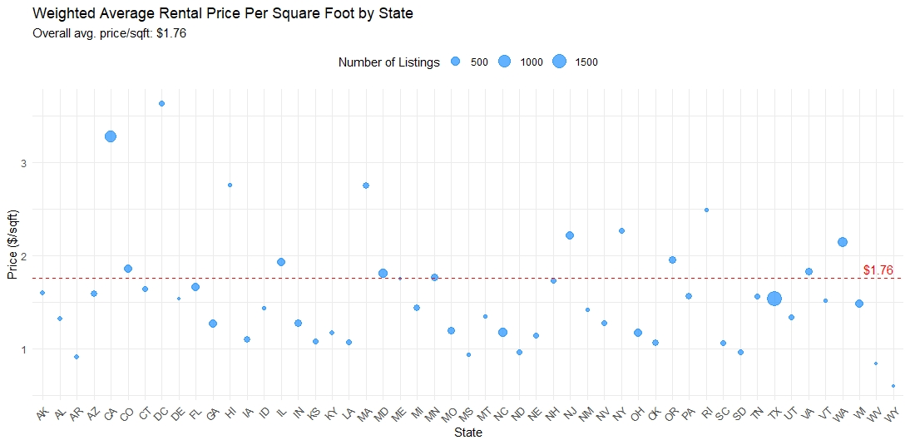

<!--- Rmarkdown for the paper. --->
<!--- Zachary Perry group 5 I think --->

---
title: "Summary of Research and EDA Process on the Apartment Rental Dataset"
author: "Zachary Perry"
date: "`r Sys.Date()`"
output: html_document
---

## Introduction

The rental market is a significant component of the US economy, influencing and being influenced by various economic and societal factors. With the continuous growth in data availability, there's an opportunity to derive insights from data to better understand this market. 

In this study, we explore a dataset detailing apartment rentals in the USA, sourced from the UCI database and supplemented with listings from "RentLingo". Comprising 10,000 observations across 22 variables, this dataset provides a comprehensive look into factors like pricing, amenities, location, and more.

Our primary goal is straightforward: to analyze the dataset, understand its intricacies, and derive actionable insights that could be beneficial for stakeholders in the rental market. This report summarizes our approach, findings, and the potential implications of those findings.

## 1. What do we know about this dataset?

The dataset serves as a window into the apartment rental landscape in the USA. It provides an amalgamation of attributes that paint a comprehensive picture of rental listings. Let's delve deeper into its characteristics:

### 1.1 Data Source and Observations

Sourced from the UCI database and enriched with listings from "RentLingo", the dataset comprises 10,000 observations. Each observation represents a unique rental listing, providing a robust foundation for our analysis. Cleaning the data is mandatory for imported datasets and this is no exception. Below is the dataset overview and tables of variable definitions, with missing values shown to display the amount of rows omitted.

### 1.2 Attributes and Data Dimensions

The dataset's richness lies in its 22 meticulously curated columns. Each attribute captures a specific facet of rental listings, and understanding these can pave the way for more in-depth analyses:

- **Identifiers**: Columns like `id` and `title` uniquely distinguish each listing, ensuring data integrity and facilitating easier referencing.
- **Geographical Details**: With attributes such as `cityname`, `state`, `latitude`, and `longitude`, the dataset provides a granular view of the geographical spread of listings. This can be pivotal in understanding regional rental trends.
- **Economic Indicators**: The `price_display` column is more than just a price tag; it's a reflection of various influencing factors, from location to amenities and apartment size.
- **Physical Characteristics**: By detailing the number of `bedrooms`, `bathrooms`, and the `square_feet` area, the dataset allows for analyses based on apartment size and structure.
- **Qualitative Descriptors**: The `body` and `amenities` columns add depth, offering a narrative and a list of extras that come with each listing. This qualitative data can be crucial when trying to understand the perceived value of a listing.

To understand the relationships between these attributes, especially the numerical ones, a correlation matrix can be invaluable:

This matrix provides a visual representation of how different variables in the dataset relate to each other. Strong correlations, whether positive or negative, can hint at underlying patterns and relationships that might be pivotal in subsequent analyses.

### 1.3 Dataset's Relevance, Potential, and Limitations

The dataset, with its diverse attributes, serves as a valuable resource for understanding the broader dynamics of the US apartment rental market. Its coverage of different geographical areas, apartment sizes, and amenities allows for a variety of analyses, from trend spotting to predictive modeling. 

However, as with any dataset, it's essential to recognize both its strengths and limitations:

- **Strengths**:
  - **Comprehensive Attributes**: The dataset's columns offer insights ranging from basic listing details to more nuanced aspects like amenities and geospatial information.
  - **Broad Coverage**: With 10,000 observations, it provides a substantial snapshot of the US apartment rental landscape.

- **Limitations**:
  - **State-Level Analyses**: Upon breaking down the dataset by states, many states appear to lack a sufficient number of observations, challenging the derivation of robust statistical inferences at the state level.
  - **Reduced Statistical Power**: With limited observations for several states, our ability to detect genuine patterns or trends is hampered, potentially missing out on genuine insights for those states.
  - **Potential for Bias**: States with sparse data are susceptible to skewed insights, where outlier listings can disproportionately influence results.
  - **Period Limitations**: The dataset captures listings from September to December, preventing a comprehensive seasonal analysis and potentially missing trends evident in other months.

In essence, the dataset offers a broad view of the US apartment rental market, but its limitations, especially concerning state-level analyses and seasonal trends, must be considered to ensure accurate and meaningful conclusions. 

## 3. How was the information gathered?

The genesis of this dataset is the UCI database, but the original data compilation was executed by "RentLingo", an online platform. This suggests a digital scraping or aggregation method, wherein listings from various sources might have been collated. It's essential to recognize the potential biases that might arise from such collection methods, such as over-representation of certain types of listings or geographies.

## 4. Inital Analyses and Findings

Our initial approach to analyzing the dataset was multi-pronged. We started with data manipulation, refining the dataset for better clarity and utility. This preparatory phase set the stage for an in-depth Exploratory Data Analysis (EDA). Through EDA, we were able to discern patterns, pinpoint relationships between variables, and lay the foundation for subsequent analyses. The primary goal was to understand the dataset's nuances and its potential predictive capabilities, leading to the construction of preliminary models.

One significant analysis involved examining the validity of grouping listings by the `states` column. To ascertain the statistical significance of this categorization, we conducted an ANOVA test. The results of this test are presented below:

A strikingly low p-value of \(2 \times 10^{-16}\) confirms the statistical significance of state-based grouping. This outcome suggests that state categorization is not only valid but can also serve as a robust control mechanism when making inferences or building predictive models. Such findings underscore the importance of understanding and leveraging geographical nuances in the dataset.

Additionally, a chi-squared test can be run on certain variables that are invariant over location such as photo availability and price. Is the price of the listing changed by the inclusion of a photo in the listing. The results of this chi-squared test are shown below that there is a lack of difference in the does and does not have photo in the listing.

## 5. Research Contribution to Question Development

Before crafting the SMART questions, it was essential to determine the narrative we wanted the data to convey. Initial research revealed the complexities of the US apartment rental market, influenced by variables like location and local amenities.

With this understanding, we began formulating questions. For instance, does an apartment's proximity to city centers influence its rental price? Or, are larger apartments more expensive in some states compared to others? These questions aimed to uncover the dataset's implications within the broader real estate context.

Further exploration of the dataset, especially its geospatial information, led to more refined questions. A notable pattern was the variation in rental prices across states. This observation prompted deeper inquiries, such as the statistical significance of these state-based differences, leading to the ANOVA test.

In essence, our approach was iterative. As we delved deeper into the data and its nuances, our questions evolved, ensuring they remained relevant to the rental market's realities.

A key dimension of our dataset is the average square footage of apartments across various states. This measure paints a vivid picture of the typical living spaces renters might encounter in different parts of the US. By comparing individual state averages with a weighted national average, we gain insights into regional variations. The following chart clearly delineates the average square footage by state, providing a comprehensive view of how each state compares to the national benchmark:

Interestingly the vast majority of states are below this average, and this is because of the massive skew caused by the California housing market. It is simply egregious and this skew can be visually shown in a graph. Other markets such as MA and HI have similarly priced markets but the size itself is the concern here, as it is the third highest quantity of all 50 states.

Deeper into this a regression of sq_ft ~ price for TX, CA, and NY can be taken to show the `Locational Premium` or the amount of price determined by the location as opposed to the square footage. 

  
  

Comparing the slopes of CA and TX their slopes are somewhat similar, but the skew of the data itself is immensely different.It is clearly shows the skew of the CA market contrasted against a more affordable market such as TX every value has been thrown to the right of the graph. The clustering in Texas much more closely follows the weighted square average calculated earlier.

## 6. Beneficial Augmentations to the Dataset

While the current dataset provides a valuable snapshot of the US apartment rental market, several enhancements can bolster its analytical and predictive capabilities. Incorporating these additions would enable a more robust and nuanced understanding of rental dynamics, catering to various stakeholders in the rental ecosystem.

### 6.1 Year-Round Data

The present dataset captures listings from September to December, offering a limited temporal perspective. A comprehensive year-round dataset would provide insights into how rental trends fluctuate across different seasons. Such information is invaluable for understanding seasonal demand patterns, rental pricing variations, and tenant mobility trends. For example, are there specific months where rentals spike due to student movements or major cultural events? Do certain seasons see a dip in rentals due to climatic challenges? Addressing these questions requires a dataset that spans the entire calendar year.

### 6.2 Enhanced State-Level Observations

One of the challenges faced in our analysis was the limited number of observations for several states, which hindered robust state-level analyses. Ensuring that each state has a statistically significant number of observations would provide a more balanced and accurate representation of regional rental trends. This would enable state-specific insights, allowing for tailored strategies and interventions for different regions.

### 6.3 Non-Bundled Amenities Data

The current dataset provides information on amenities, but there's an opportunity to delve deeper. Listings often bundle multiple amenities together, making it challenging to discern the individual value and appeal of each amenity. A dataset that itemizes non-bundled amenities—listing them separately for each property—would allow for a more granular analysis. For instance, how much value does a gym add compared to a swimming pool? Is a pet-friendly policy more attractive in urban settings compared to suburban ones? By isolating amenities, we can derive more precise insights into their individual impact on rental prices and tenant preferences.

In essence, while the existing dataset serves as a solid foundation for understanding the rental market, these proposed augmentations would significantly enhance its depth and breadth. Such enhancements would ensure that the dataset not only reflects the current rental landscape but also anticipates future trends and challenges.

## 7. Evolution of the Research Question Post-EDA

The beauty of EDA is its ability to mold and refine the research direction. While the foundational questions around rental drivers remained, the nuances changed. The emphasis shifted towards a more granular understanding, such as the role of specific amenities in price determination or the impact of apartment location vis-
